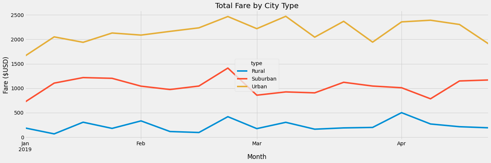

# Pyber Challenge

### 4.3 Loading and Reading CSV files


```python
# Add Matplotlib inline magic command
%matplotlib inline
# Dependencies and Setup
import matplotlib.pyplot as plt
import pandas as pd

# File to Load (Remember to change these)
city_data_to_load = "../Resources/city_data.csv"
ride_data_to_load = "../Resources/ride_data.csv"
```


```python
# Read the City and Ride Data
city_data_df = pd.read_csv(city_data_to_load)
ride_data_df = pd.read_csv(ride_data_to_load)
```

### Merge the DataFrames


```python
# Combine the data into a single dataset
pyber_data_df = pd.merge(ride_data_df, city_data_df, how="left", on=["city", "city"])

# Display the data table for preview
pyber_data_df.head()
```


<div>
<style scoped>
    .dataframe tbody tr th:only-of-type {
        vertical-align: middle;
    }

    .dataframe tbody tr th {
        vertical-align: top;
    }

    .dataframe thead th {
        text-align: right;
    }
</style>
<table border="1" class="dataframe">
  <thead>
    <tr style="text-align: right;">
      <th></th>
      <th>city</th>
      <th>date</th>
      <th>fare</th>
      <th>ride_id</th>
      <th>driver_count</th>
      <th>type</th>
    </tr>
  </thead>
  <tbody>
    <tr>
      <th>0</th>
      <td>Lake Jonathanshire</td>
      <td>2019-01-14 10:14:22</td>
      <td>13.83</td>
      <td>5739410935873</td>
      <td>5</td>
      <td>Urban</td>
    </tr>
    <tr>
      <th>1</th>
      <td>South Michelleport</td>
      <td>2019-03-04 18:24:09</td>
      <td>30.24</td>
      <td>2343912425577</td>
      <td>72</td>
      <td>Urban</td>
    </tr>
    <tr>
      <th>2</th>
      <td>Port Samanthamouth</td>
      <td>2019-02-24 04:29:00</td>
      <td>33.44</td>
      <td>2005065760003</td>
      <td>57</td>
      <td>Urban</td>
    </tr>
    <tr>
      <th>3</th>
      <td>Rodneyfort</td>
      <td>2019-02-10 23:22:03</td>
      <td>23.44</td>
      <td>5149245426178</td>
      <td>34</td>
      <td>Urban</td>
    </tr>
    <tr>
      <th>4</th>
      <td>South Jack</td>
      <td>2019-03-06 04:28:35</td>
      <td>34.58</td>
      <td>3908451377344</td>
      <td>46</td>
      <td>Urban</td>
    </tr>
  </tbody>
</table>
</div>


## Deliverable 1. Generate a Ride-Sharing DataFrame by City Type


```python
#  1. Get the total rides for each city type
total_rides_by_type = pyber_data_df.groupby(["type"]).count()["ride_id"]
total_rides_by_type
```


    type
    Rural        125
    Suburban     625
    Urban       1625
    Name: ride_id, dtype: int64


```python
# 2. Get the total drivers for each city type
total_drivers_by_type = city_data_df.groupby(["type"]).sum()["driver_count"]
total_drivers_by_type
```


    type
    Rural         78
    Suburban     490
    Urban       2405
    Name: driver_count, dtype: int64


```python
#  3. Get the sum of all fares for each city type
total_fare_by_type = pyber_data_df.groupby(["type"]).sum()["fare"]
total_fare_by_type
```


    type
    Rural        4327.93
    Suburban    19356.33
    Urban       39854.38
    Name: fare, dtype: float64


```python
#  4. Get the average fare per ride for each city type. 
avg_fare_per_ride = total_fare_by_type / total_rides_by_type
avg_fare_per_ride
```


    type
    Rural       34.623440
    Suburban    30.970128
    Urban       24.525772
    dtype: float64


```python
# 5. Get the average fare per driver for each city type. 
avg_fare_per_driver = total_fare_by_type / total_drivers_by_type 
avg_fare_per_driver
```


    type
    Rural       55.486282
    Suburban    39.502714
    Urban       16.571468
    dtype: float64


```python
#  6. Create a PyBer summary DataFrame. 
pyber_ride_summary_df = pd.DataFrame({
    "Total Rides": total_rides_by_type,
    "Total Drivers": total_drivers_by_type,
    "Total Fares": total_fare_by_type,
    "Average Fare per Ride": avg_fare_per_ride,
    "Average Fare per Driver": avg_fare_per_driver})

pyber_ride_summary_df
```


<div>
<style scoped>
    .dataframe tbody tr th:only-of-type {
        vertical-align: middle;
    }

    .dataframe tbody tr th {
        vertical-align: top;
    }

    .dataframe thead th {
        text-align: right;
    }
</style>
<table border="1" class="dataframe">
  <thead>
    <tr style="text-align: right;">
      <th></th>
      <th>Total Rides</th>
      <th>Total Drivers</th>
      <th>Total Fares</th>
      <th>Average Fare per Ride</th>
      <th>Average Fare per Driver</th>
    </tr>
    <tr>
      <th>type</th>
      <th></th>
      <th></th>
      <th></th>
      <th></th>
      <th></th>
    </tr>
  </thead>
  <tbody>
    <tr>
      <th>Rural</th>
      <td>125</td>
      <td>78</td>
      <td>4327.93</td>
      <td>34.623440</td>
      <td>55.486282</td>
    </tr>
    <tr>
      <th>Suburban</th>
      <td>625</td>
      <td>490</td>
      <td>19356.33</td>
      <td>30.970128</td>
      <td>39.502714</td>
    </tr>
    <tr>
      <th>Urban</th>
      <td>1625</td>
      <td>2405</td>
      <td>39854.38</td>
      <td>24.525772</td>
      <td>16.571468</td>
    </tr>
  </tbody>
</table>
</div>


```python
#  7. Delete the index name
pyber_ride_summary_df.index.name = None
pyber_ride_summary_df
```


<div>
<style scoped>
    .dataframe tbody tr th:only-of-type {
        vertical-align: middle;
    }

    .dataframe tbody tr th {
        vertical-align: top;
    }

    .dataframe thead th {
        text-align: right;
    }
</style>
<table border="1" class="dataframe">
  <thead>
    <tr style="text-align: right;">
      <th></th>
      <th>Total Rides</th>
      <th>Total Drivers</th>
      <th>Total Fares</th>
      <th>Average Fare per Ride</th>
      <th>Average Fare per Driver</th>
    </tr>
  </thead>
  <tbody>
    <tr>
      <th>Rural</th>
      <td>125</td>
      <td>78</td>
      <td>4327.93</td>
      <td>34.623440</td>
      <td>55.486282</td>
    </tr>
    <tr>
      <th>Suburban</th>
      <td>625</td>
      <td>490</td>
      <td>19356.33</td>
      <td>30.970128</td>
      <td>39.502714</td>
    </tr>
    <tr>
      <th>Urban</th>
      <td>1625</td>
      <td>2405</td>
      <td>39854.38</td>
      <td>24.525772</td>
      <td>16.571468</td>
    </tr>
  </tbody>
</table>
</div>


```python
# 8. Format the columns.
pyber_ride_summary_df["Total Rides"] = pyber_ride_summary_df["Total Rides"].map("{:,}".format)
pyber_ride_summary_df["Total Drivers"] = pyber_ride_summary_df["Total Drivers"].map("{:,}".format)
pyber_ride_summary_df["Total Fares"] = pyber_ride_summary_df["Total Fares"].map("${:,.2f}".format)
pyber_ride_summary_df["Average Fare per Ride"] = pyber_ride_summary_df["Average Fare per Ride"].map("${:.2f}".format)
pyber_ride_summary_df["Average Fare per Driver"] = pyber_ride_summary_df["Average Fare per Driver"].map("${:.2f}".format)

# Display the data frame
pyber_ride_summary_df
```


<div>
<style scoped>
    .dataframe tbody tr th:only-of-type {
        vertical-align: middle;
    }

    .dataframe tbody tr th {
        vertical-align: top;
    }

    .dataframe thead th {
        text-align: right;
    }
</style>
<table border="1" class="dataframe">
  <thead>
    <tr style="text-align: right;">
      <th></th>
      <th>Total Rides</th>
      <th>Total Drivers</th>
      <th>Total Fares</th>
      <th>Average Fare per Ride</th>
      <th>Average Fare per Driver</th>
    </tr>
  </thead>
  <tbody>
    <tr>
      <th>Rural</th>
      <td>125</td>
      <td>78</td>
      <td>$4,327.93</td>
      <td>$34.62</td>
      <td>$55.49</td>
    </tr>
    <tr>
      <th>Suburban</th>
      <td>625</td>
      <td>490</td>
      <td>$19,356.33</td>
      <td>$30.97</td>
      <td>$39.50</td>
    </tr>
    <tr>
      <th>Urban</th>
      <td>1,625</td>
      <td>2,405</td>
      <td>$39,854.38</td>
      <td>$24.53</td>
      <td>$16.57</td>
    </tr>
  </tbody>
</table>
</div>


## Deliverable 2:  Create a multiple line plot that shows the total weekly of the fares for each type of city.


```python
# Print the merged DataFrame for reference.
pyber_data_df.head(10)
```


<div>
<style scoped>
    .dataframe tbody tr th:only-of-type {
        vertical-align: middle;
    }

    .dataframe tbody tr th {
        vertical-align: top;
    }

    .dataframe thead th {
        text-align: right;
    }
</style>
<table border="1" class="dataframe">
  <thead>
    <tr style="text-align: right;">
      <th></th>
      <th>city</th>
      <th>date</th>
      <th>fare</th>
      <th>ride_id</th>
      <th>driver_count</th>
      <th>type</th>
    </tr>
  </thead>
  <tbody>
    <tr>
      <th>0</th>
      <td>Lake Jonathanshire</td>
      <td>2019-01-14 10:14:22</td>
      <td>13.83</td>
      <td>5739410935873</td>
      <td>5</td>
      <td>Urban</td>
    </tr>
    <tr>
      <th>1</th>
      <td>South Michelleport</td>
      <td>2019-03-04 18:24:09</td>
      <td>30.24</td>
      <td>2343912425577</td>
      <td>72</td>
      <td>Urban</td>
    </tr>
    <tr>
      <th>2</th>
      <td>Port Samanthamouth</td>
      <td>2019-02-24 04:29:00</td>
      <td>33.44</td>
      <td>2005065760003</td>
      <td>57</td>
      <td>Urban</td>
    </tr>
    <tr>
      <th>3</th>
      <td>Rodneyfort</td>
      <td>2019-02-10 23:22:03</td>
      <td>23.44</td>
      <td>5149245426178</td>
      <td>34</td>
      <td>Urban</td>
    </tr>
    <tr>
      <th>4</th>
      <td>South Jack</td>
      <td>2019-03-06 04:28:35</td>
      <td>34.58</td>
      <td>3908451377344</td>
      <td>46</td>
      <td>Urban</td>
    </tr>
    <tr>
      <th>5</th>
      <td>South Latoya</td>
      <td>2019-03-11 12:26:48</td>
      <td>9.52</td>
      <td>1994999424437</td>
      <td>10</td>
      <td>Urban</td>
    </tr>
    <tr>
      <th>6</th>
      <td>New Paulville</td>
      <td>2019-02-27 11:17:56</td>
      <td>43.25</td>
      <td>793208410091</td>
      <td>44</td>
      <td>Urban</td>
    </tr>
    <tr>
      <th>7</th>
      <td>Simpsonburgh</td>
      <td>2019-04-26 00:43:24</td>
      <td>35.98</td>
      <td>111953927754</td>
      <td>21</td>
      <td>Urban</td>
    </tr>
    <tr>
      <th>8</th>
      <td>South Karenland</td>
      <td>2019-01-08 03:28:48</td>
      <td>35.09</td>
      <td>7995623208694</td>
      <td>4</td>
      <td>Urban</td>
    </tr>
    <tr>
      <th>9</th>
      <td>North Jasmine</td>
      <td>2019-03-09 06:26:29</td>
      <td>42.81</td>
      <td>5327642267789</td>
      <td>33</td>
      <td>Urban</td>
    </tr>
  </tbody>
</table>
</div>


```python
# 1. Using groupby() to create a new DataFrame showing the sum of the fares 
#  for each date where the indices are the city type and date. 
sum_fare_by_type = pyber_data_df.groupby(["type", "date"]).sum()[["fare"]]
sum_fare_by_type.head(10)
```


<div>
<style scoped>
    .dataframe tbody tr th:only-of-type {
        vertical-align: middle;
    }

    .dataframe tbody tr th {
        vertical-align: top;
    }

    .dataframe thead th {
        text-align: right;
    }
</style>
<table border="1" class="dataframe">
  <thead>
    <tr style="text-align: right;">
      <th></th>
      <th></th>
      <th>fare</th>
    </tr>
    <tr>
      <th>type</th>
      <th>date</th>
      <th></th>
    </tr>
  </thead>
  <tbody>
    <tr>
      <th rowspan="10" valign="top">Rural</th>
      <th>2019-01-01 09:45:36</th>
      <td>43.69</td>
    </tr>
    <tr>
      <th>2019-01-02 11:18:32</th>
      <td>52.12</td>
    </tr>
    <tr>
      <th>2019-01-03 19:51:01</th>
      <td>19.90</td>
    </tr>
    <tr>
      <th>2019-01-04 03:31:26</th>
      <td>24.88</td>
    </tr>
    <tr>
      <th>2019-01-06 07:38:40</th>
      <td>47.33</td>
    </tr>
    <tr>
      <th>2019-01-08 06:19:45</th>
      <td>19.39</td>
    </tr>
    <tr>
      <th>2019-01-09 15:30:35</th>
      <td>31.84</td>
    </tr>
    <tr>
      <th>2019-01-11 04:39:27</th>
      <td>16.42</td>
    </tr>
    <tr>
      <th>2019-01-14 07:09:17</th>
      <td>18.05</td>
    </tr>
    <tr>
      <th>2019-01-14 15:58:48</th>
      <td>54.10</td>
    </tr>
  </tbody>
</table>
</div>


```python
# 2. Reset the index on the DataFrame you created in #1. This is needed to use the 'pivot()' function.
sum_fare_by_type = sum_fare_by_type.reset_index()
sum_fare_by_type.head(10)
```


<div>
<style scoped>
    .dataframe tbody tr th:only-of-type {
        vertical-align: middle;
    }

    .dataframe tbody tr th {
        vertical-align: top;
    }

    .dataframe thead th {
        text-align: right;
    }
</style>
<table border="1" class="dataframe">
  <thead>
    <tr style="text-align: right;">
      <th></th>
      <th>type</th>
      <th>date</th>
      <th>fare</th>
    </tr>
  </thead>
  <tbody>
    <tr>
      <th>0</th>
      <td>Rural</td>
      <td>2019-01-01 09:45:36</td>
      <td>43.69</td>
    </tr>
    <tr>
      <th>1</th>
      <td>Rural</td>
      <td>2019-01-02 11:18:32</td>
      <td>52.12</td>
    </tr>
    <tr>
      <th>2</th>
      <td>Rural</td>
      <td>2019-01-03 19:51:01</td>
      <td>19.90</td>
    </tr>
    <tr>
      <th>3</th>
      <td>Rural</td>
      <td>2019-01-04 03:31:26</td>
      <td>24.88</td>
    </tr>
    <tr>
      <th>4</th>
      <td>Rural</td>
      <td>2019-01-06 07:38:40</td>
      <td>47.33</td>
    </tr>
    <tr>
      <th>5</th>
      <td>Rural</td>
      <td>2019-01-08 06:19:45</td>
      <td>19.39</td>
    </tr>
    <tr>
      <th>6</th>
      <td>Rural</td>
      <td>2019-01-09 15:30:35</td>
      <td>31.84</td>
    </tr>
    <tr>
      <th>7</th>
      <td>Rural</td>
      <td>2019-01-11 04:39:27</td>
      <td>16.42</td>
    </tr>
    <tr>
      <th>8</th>
      <td>Rural</td>
      <td>2019-01-14 07:09:17</td>
      <td>18.05</td>
    </tr>
    <tr>
      <th>9</th>
      <td>Rural</td>
      <td>2019-01-14 15:58:48</td>
      <td>54.10</td>
    </tr>
  </tbody>
</table>
</div>


```python
# 3. Create a pivot table with the "date" as the index and the columns ='type' with the fare in each row.
sum_fare_by_type_pivot = sum_fare_by_type.pivot(index="date", columns="type", values="fare")
sum_fare_by_type_pivot.head(10)
```


<div>
<style scoped>
    .dataframe tbody tr th:only-of-type {
        vertical-align: middle;
    }

    .dataframe tbody tr th {
        vertical-align: top;
    }

    .dataframe thead th {
        text-align: right;
    }
</style>
<table border="1" class="dataframe">
  <thead>
    <tr style="text-align: right;">
      <th>type</th>
      <th>Rural</th>
      <th>Suburban</th>
      <th>Urban</th>
    </tr>
    <tr>
      <th>date</th>
      <th></th>
      <th></th>
      <th></th>
    </tr>
  </thead>
  <tbody>
    <tr>
      <th>2019-01-01 00:08:16</th>
      <td>NaN</td>
      <td>NaN</td>
      <td>37.91</td>
    </tr>
    <tr>
      <th>2019-01-01 00:46:46</th>
      <td>NaN</td>
      <td>47.74</td>
      <td>NaN</td>
    </tr>
    <tr>
      <th>2019-01-01 02:07:24</th>
      <td>NaN</td>
      <td>24.07</td>
      <td>NaN</td>
    </tr>
    <tr>
      <th>2019-01-01 03:46:50</th>
      <td>NaN</td>
      <td>NaN</td>
      <td>7.57</td>
    </tr>
    <tr>
      <th>2019-01-01 05:23:21</th>
      <td>NaN</td>
      <td>NaN</td>
      <td>10.75</td>
    </tr>
    <tr>
      <th>2019-01-01 09:45:36</th>
      <td>43.69</td>
      <td>NaN</td>
      <td>NaN</td>
    </tr>
    <tr>
      <th>2019-01-01 12:32:48</th>
      <td>NaN</td>
      <td>25.56</td>
      <td>NaN</td>
    </tr>
    <tr>
      <th>2019-01-01 14:40:14</th>
      <td>NaN</td>
      <td>NaN</td>
      <td>5.42</td>
    </tr>
    <tr>
      <th>2019-01-01 14:42:25</th>
      <td>NaN</td>
      <td>NaN</td>
      <td>12.31</td>
    </tr>
    <tr>
      <th>2019-01-01 14:52:06</th>
      <td>NaN</td>
      <td>31.15</td>
      <td>NaN</td>
    </tr>
  </tbody>
</table>
</div>


```python
# 4. Create a new DataFrame from the pivot table DataFrame using loc on the given dates, '2019-01-01':'2019-04-29'.
fares_Jan_April = sum_fare_by_type_pivot.loc['2019-01-01':'2019-04-28']
fares_Jan_April.head(20)
```


<div>
<style scoped>
    .dataframe tbody tr th:only-of-type {
        vertical-align: middle;
    }

    .dataframe tbody tr th {
        vertical-align: top;
    }

    .dataframe thead th {
        text-align: right;
    }
</style>
<table border="1" class="dataframe">
  <thead>
    <tr style="text-align: right;">
      <th>type</th>
      <th>Rural</th>
      <th>Suburban</th>
      <th>Urban</th>
    </tr>
    <tr>
      <th>date</th>
      <th></th>
      <th></th>
      <th></th>
    </tr>
  </thead>
  <tbody>
    <tr>
      <th>2019-01-01 00:08:16</th>
      <td>NaN</td>
      <td>NaN</td>
      <td>37.91</td>
    </tr>
    <tr>
      <th>2019-01-01 00:46:46</th>
      <td>NaN</td>
      <td>47.74</td>
      <td>NaN</td>
    </tr>
    <tr>
      <th>2019-01-01 02:07:24</th>
      <td>NaN</td>
      <td>24.07</td>
      <td>NaN</td>
    </tr>
    <tr>
      <th>2019-01-01 03:46:50</th>
      <td>NaN</td>
      <td>NaN</td>
      <td>7.57</td>
    </tr>
    <tr>
      <th>2019-01-01 05:23:21</th>
      <td>NaN</td>
      <td>NaN</td>
      <td>10.75</td>
    </tr>
    <tr>
      <th>2019-01-01 09:45:36</th>
      <td>43.69</td>
      <td>NaN</td>
      <td>NaN</td>
    </tr>
    <tr>
      <th>2019-01-01 12:32:48</th>
      <td>NaN</td>
      <td>25.56</td>
      <td>NaN</td>
    </tr>
    <tr>
      <th>2019-01-01 14:40:14</th>
      <td>NaN</td>
      <td>NaN</td>
      <td>5.42</td>
    </tr>
    <tr>
      <th>2019-01-01 14:42:25</th>
      <td>NaN</td>
      <td>NaN</td>
      <td>12.31</td>
    </tr>
    <tr>
      <th>2019-01-01 14:52:06</th>
      <td>NaN</td>
      <td>31.15</td>
      <td>NaN</td>
    </tr>
    <tr>
      <th>2019-01-01 17:22:58</th>
      <td>NaN</td>
      <td>NaN</td>
      <td>42.11</td>
    </tr>
    <tr>
      <th>2019-01-01 21:04:01</th>
      <td>NaN</td>
      <td>NaN</td>
      <td>11.71</td>
    </tr>
    <tr>
      <th>2019-01-02 00:13:08</th>
      <td>NaN</td>
      <td>44.71</td>
      <td>NaN</td>
    </tr>
    <tr>
      <th>2019-01-02 00:44:03</th>
      <td>NaN</td>
      <td>NaN</td>
      <td>43.72</td>
    </tr>
    <tr>
      <th>2019-01-02 00:56:53</th>
      <td>NaN</td>
      <td>NaN</td>
      <td>37.34</td>
    </tr>
    <tr>
      <th>2019-01-02 01:41:26</th>
      <td>NaN</td>
      <td>49.95</td>
      <td>NaN</td>
    </tr>
    <tr>
      <th>2019-01-02 01:46:40</th>
      <td>NaN</td>
      <td>NaN</td>
      <td>34.79</td>
    </tr>
    <tr>
      <th>2019-01-02 06:55:36</th>
      <td>NaN</td>
      <td>NaN</td>
      <td>16.96</td>
    </tr>
    <tr>
      <th>2019-01-02 07:26:53</th>
      <td>NaN</td>
      <td>33.57</td>
      <td>NaN</td>
    </tr>
    <tr>
      <th>2019-01-02 09:28:27</th>
      <td>NaN</td>
      <td>NaN</td>
      <td>19.81</td>
    </tr>
  </tbody>
</table>
</div>


```python
# 5. Set the "date" index to datetime datatype. This is necessary to use the resample() method. 
fares_Jan_April.index = pd.to_datetime(fares_Jan_April.index)
fares_Jan_April
```


<div>
<style scoped>
    .dataframe tbody tr th:only-of-type {
        vertical-align: middle;
    }

    .dataframe tbody tr th {
        vertical-align: top;
    }

    .dataframe thead th {
        text-align: right;
    }
</style>
<table border="1" class="dataframe">
  <thead>
    <tr style="text-align: right;">
      <th>type</th>
      <th>Rural</th>
      <th>Suburban</th>
      <th>Urban</th>
    </tr>
    <tr>
      <th>date</th>
      <th></th>
      <th></th>
      <th></th>
    </tr>
  </thead>
  <tbody>
    <tr>
      <th>2019-01-01 00:08:16</th>
      <td>NaN</td>
      <td>NaN</td>
      <td>37.91</td>
    </tr>
    <tr>
      <th>2019-01-01 00:46:46</th>
      <td>NaN</td>
      <td>47.74</td>
      <td>NaN</td>
    </tr>
    <tr>
      <th>2019-01-01 02:07:24</th>
      <td>NaN</td>
      <td>24.07</td>
      <td>NaN</td>
    </tr>
    <tr>
      <th>2019-01-01 03:46:50</th>
      <td>NaN</td>
      <td>NaN</td>
      <td>7.57</td>
    </tr>
    <tr>
      <th>2019-01-01 05:23:21</th>
      <td>NaN</td>
      <td>NaN</td>
      <td>10.75</td>
    </tr>
    <tr>
      <th>...</th>
      <td>...</td>
      <td>...</td>
      <td>...</td>
    </tr>
    <tr>
      <th>2019-04-27 17:58:27</th>
      <td>14.01</td>
      <td>NaN</td>
      <td>NaN</td>
    </tr>
    <tr>
      <th>2019-04-27 19:45:48</th>
      <td>NaN</td>
      <td>28.84</td>
      <td>NaN</td>
    </tr>
    <tr>
      <th>2019-04-27 20:41:36</th>
      <td>NaN</td>
      <td>NaN</td>
      <td>8.28</td>
    </tr>
    <tr>
      <th>2019-04-27 23:26:03</th>
      <td>NaN</td>
      <td>NaN</td>
      <td>19.06</td>
    </tr>
    <tr>
      <th>2019-04-27 23:52:44</th>
      <td>NaN</td>
      <td>45.98</td>
      <td>NaN</td>
    </tr>
  </tbody>
</table>
<p>2177 rows × 3 columns</p>
</div>


```python
# 6. Check that the datatype for the index is datetime using .info()
fares_Jan_April.info()
```

    <class 'pandas.core.frame.DataFrame'>
    DatetimeIndex: 2177 entries, 2019-01-01 00:08:16 to 2019-04-27 23:52:44
    Data columns (total 3 columns):
     #   Column    Non-Null Count  Dtype  
    ---  ------    --------------  -----  
     0   Rural     114 non-null    float64
     1   Suburban  567 non-null    float64
     2   Urban     1496 non-null   float64
    dtypes: float64(3)
    memory usage: 68.0 KB


```python
# 7. Create a new DataFrame using the "resample()" function by week 'W' and get the sum of the fares for each week. 
weekly_fares_df = fares_Jan_April.resample('W').sum()
weekly_fares_df.head(10)
```


<div>
<style scoped>
    .dataframe tbody tr th:only-of-type {
        vertical-align: middle;
    }

    .dataframe tbody tr th {
        vertical-align: top;
    }

    .dataframe thead th {
        text-align: right;
    }
</style>
<table border="1" class="dataframe">
  <thead>
    <tr style="text-align: right;">
      <th>type</th>
      <th>Rural</th>
      <th>Suburban</th>
      <th>Urban</th>
    </tr>
    <tr>
      <th>date</th>
      <th></th>
      <th></th>
      <th></th>
    </tr>
  </thead>
  <tbody>
    <tr>
      <th>2019-01-06</th>
      <td>187.92</td>
      <td>721.60</td>
      <td>1661.68</td>
    </tr>
    <tr>
      <th>2019-01-13</th>
      <td>67.65</td>
      <td>1105.13</td>
      <td>2050.43</td>
    </tr>
    <tr>
      <th>2019-01-20</th>
      <td>306.00</td>
      <td>1218.20</td>
      <td>1939.02</td>
    </tr>
    <tr>
      <th>2019-01-27</th>
      <td>179.69</td>
      <td>1203.28</td>
      <td>2129.51</td>
    </tr>
    <tr>
      <th>2019-02-03</th>
      <td>333.08</td>
      <td>1042.79</td>
      <td>2086.94</td>
    </tr>
    <tr>
      <th>2019-02-10</th>
      <td>115.80</td>
      <td>974.34</td>
      <td>2162.64</td>
    </tr>
    <tr>
      <th>2019-02-17</th>
      <td>95.82</td>
      <td>1045.50</td>
      <td>2235.07</td>
    </tr>
    <tr>
      <th>2019-02-24</th>
      <td>419.06</td>
      <td>1412.74</td>
      <td>2466.29</td>
    </tr>
    <tr>
      <th>2019-03-03</th>
      <td>175.14</td>
      <td>858.46</td>
      <td>2218.20</td>
    </tr>
    <tr>
      <th>2019-03-10</th>
      <td>303.94</td>
      <td>925.27</td>
      <td>2470.93</td>
    </tr>
  </tbody>
</table>
</div>


```python
# 8. Using the object-oriented interface method, plot the resample DataFrame 
# using the df.plot() function. 

# Import the style from Matplotlib.
from matplotlib import style
# Use the graph style fivethirtyeight.
style.use('fivethirtyeight')

ax = weekly_fares_df.plot(figsize = (20,6))
# Add a title 
ax.set_title("Total Fare by City Type")
#  Add a x- and y-axis label.
ax.set_xlabel("Month")
ax.set_ylabel("Fare ($USD)")
plt.savefig("analysis/Challenge_fare_summary.png")
plt.show()
```





```python

```
