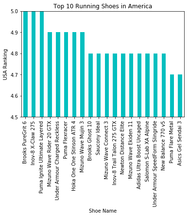
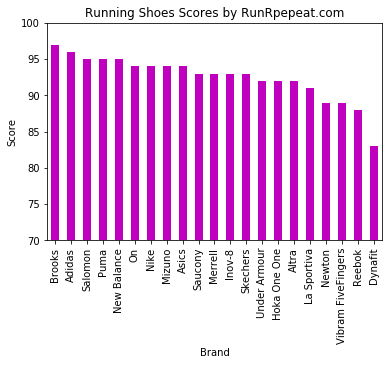
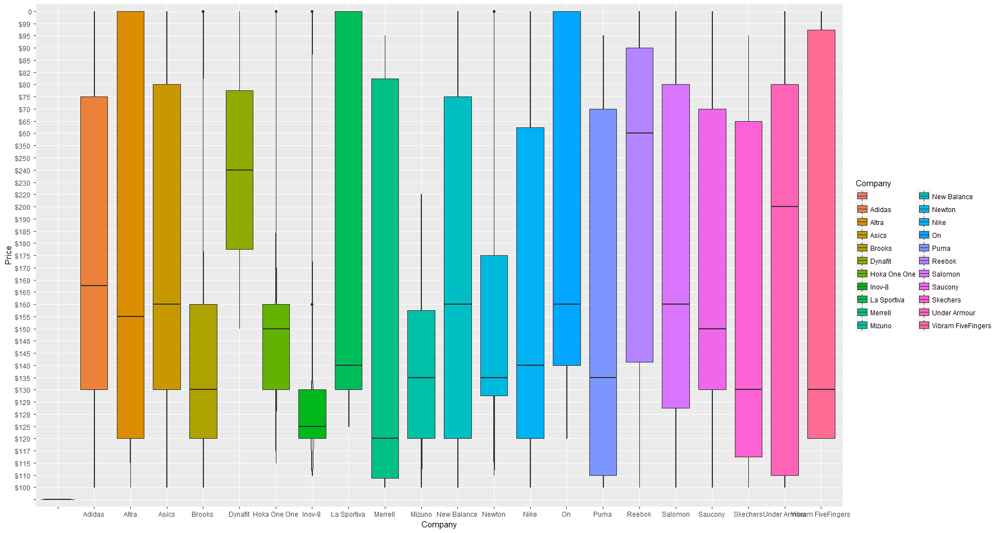
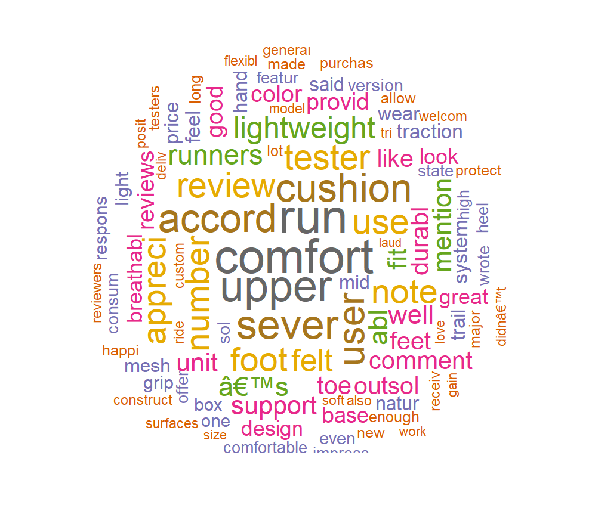

# WebScraping
For my web scraping project I decided to scrape http://www.runrepeat.com, a running shoes discovery and review platform. It has over 134,867 expert reviews and over 1000 shoes for users to choose from.

## Research Questions
1. What are popular shoe brands?
1. What are the popular shoes for specific needs?
1. What features may have critical influences on customers satisfaction?

## Scope
In order to narrow down my research scope, I focused on the top women's running shoes in all categories. I was able to scrape 400+ shoes with top scores in terms of popularity and top reviews. For product datasets, I scraped brand name, shoe name, overall product rating, run score, rank, summary and reviews. Plus, the web scraping review dataset includes shoe details like terrain, use, release dates, score, reviews, review summary etc.

## Exploratory Data Analysis
### Top ten running shoes in America

### Top ten running shoes scores by RunRepeat.com

### Price Distribution

## NLP - Natural Language Processing
### Word cloud of good reviews

